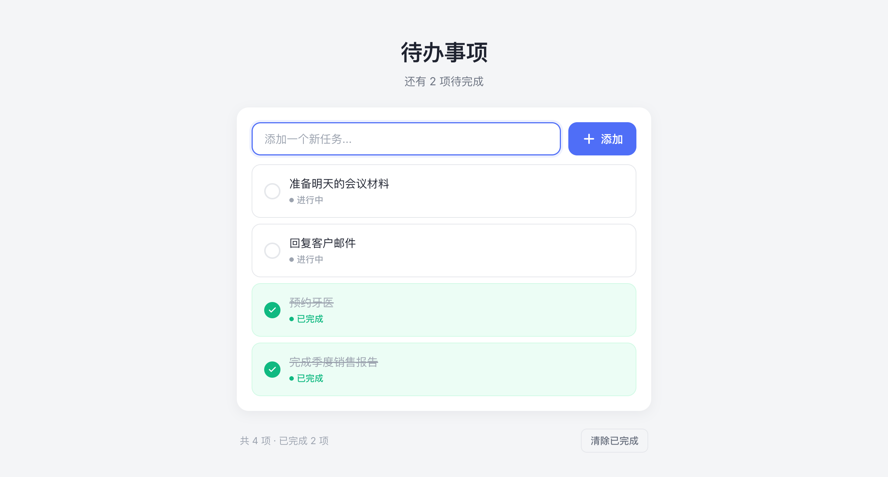

# 极简待办 · Minimal Todo

> 一个零依赖、零构建的极简待办事项网页应用。双击即可运行，数据保存在浏览器本地。


## 项目简介

Minimal Todo 是一个纯前端的待办事项管理工具，旨在提供干净、现代、无干扰的任务管理体验。无需注册登录、无需后端服务器、无需安装任何依赖，打开浏览器即可使用。所有数据存储在用户本地浏览器中，充分保护隐私。

适合用于：日常任务管理、购物清单、学习计划、快速备忘等轻量待办场景。

## 功能特性

- ✅ **添加待办** — 输入任务名称，点击按钮或按回车快速添加
- ✅ **完成 / 取消完成** — 点击圆形复选框切换状态，完成后文字加删除线
- ✅ **删除待办** — 单条删除，带滑出动画
- ✅ **批量清除** — 一键清除所有已完成项
- ✅ **状态展示** — 每条待办显示「进行中 / 已完成」状态标签
- ✅ **智能排序** — 未完成项自动排在前面，已完成项沉底
- ✅ **实时统计** — 顶部显示剩余待办数，底部显示总数与完成数
- ✅ **本地持久化** — 数据存入 `localStorage`，刷新 / 关闭浏览器后不丢失
- ✅ **响应式布局** — 桌面端与移动端自适应，手机端添加按钮收缩为图标
- ✅ **无障碍支持** — 语义化 HTML、`aria-label`、键盘可操作、焦点可见
- ✅ **空状态引导** — 无待办时显示友好的空状态提示

## 效果预览



## 技术栈

| 层级 | 技术 |
|------|------|
| 结构 | HTML5（语义化标签） |
| 样式 | CSS3（CSS 变量设计系统、Flexbox、Grid、媒体查询） |
| 逻辑 | 原生 JavaScript（ES6+，IIFE 封装，无框架） |
| 存储 | Web Storage API（`localStorage`） |
| 字体 | Inter（Google Fonts，中文回退系统字体） |
| 图标 | 内联 SVG（无外部图标库依赖） |

## 安装与使用

### 方式一：直接打开（推荐）

无需安装任何东西。克隆或下载本项目后，双击 `index.html` 即可在默认浏览器中运行。

```bash
# 克隆项目
git clone https://github.com/sanrijj/minimal-todo.git
cd minimal-todo

# 直接打开（macOS）
open index.html

# 直接打开（Windows）
start index.html

# 直接打开（Linux）
xdg-open index.html
```

### 方式二：本地服务器

如果浏览器对 `file://` 协议有限制（如部分字体或安全策略），可启动本地静态服务器：

```bash
# Python 3（macOS / Linux 通常自带）
python3 -m http.server 8000

# 或 Node.js
npx serve .

# 或 PHP
php -S localhost:8000
```

启动后在浏览器访问 `http://localhost:8000`。

### 方式三：部署到静态托管

本项目为纯静态文件，可直接部署到任何静态托管平台：

- **GitHub Pages**：将项目推送到 GitHub 仓库，在 Settings → Pages 中启用
- **Netlify Drop**：将整个文件夹拖拽到 [app.netlify.com/drop](https://app.netlify.com/drop)
- **Vercel**：`vercel` 命令一键部署
- **Cloudflare Pages**：连接 Git 仓库自动部署

## 输入规格

### 待办内容输入

| 属性 | 规格 |
|------|------|
| 输入控件 | 单行文本输入框 `<input type="text">` |
| 最大长度 | 200 字符（`maxlength="200"`，超出部分浏览器自动截断） |
| 空白处理 | 提交时自动去除首尾空白（`trim()`）；全空白内容不创建待办 |
| 重复内容 | 允许创建内容相同的多条待办（通过唯一 ID 区分） |
| 特殊字符 | 支持任意 Unicode 字符（中文、英文、emoji、符号等），通过 `textContent` 渲染，自动转义，无 XSS 风险 |
| 提交方式 | 点击「添加」按钮 或 在输入框中按回车键（`Enter`） |
| 提交后行为 | 输入框清空并自动重新聚焦，可连续添加 |

### 交互输入

| 操作 | 触发方式 | 行为 |
|------|----------|------|
| 切换完成状态 | 点击待办左侧圆形复选框 | 完成 ↔ 进行中 状态切换 |
| 删除单条 | 点击待办右侧垃圾桶图标 | 播放 180ms 滑出动画后移除 |
| 清除已完成 | 点击底部「清除已完成」按钮 | 批量删除所有 `completed=true` 的待办 |
| 键盘导航 | `Tab` / `Shift+Tab` | 在输入框、按钮、复选框间有序切换 |

## 输出规格

### 界面输出

| 元素 | 状态 | 视觉表现 |
|------|------|----------|
| 待办卡片 | 进行中 | 白色背景 `#ffffff`，灰色边框 `#e5e7eb`，黑色文字 |
| 待办卡片 | 已完成 | 浅绿背景 `#ecfdf5`，绿色边框 `#d1fae5`，灰色删除线文字 |
| 复选框 | 未完成 | 空心圆，灰色边框 `#e5e7eb` |
| 复选框 | 已完成 | 实心绿圆 `#10b981`，白色对勾 SVG |
| 状态标签 | 进行中 | 灰色文字 `#9ca3af` + 灰色圆点 |
| 状态标签 | 已完成 | 绿色文字 `#10b981` + 绿色圆点 |
| 任务文字 | 已完成 | `text-decoration: line-through`，颜色 `#9ca3af` |
| 删除按钮 | 桌面端 | 默认透明，悬停时显示（`opacity: 0 → 1`） |
| 删除按钮 | 移动端 | 始终可见（`opacity: 1`） |
| 空状态 | 无待办时 | 显示勾选图标 + 「还没有待办事项」引导文案 |
| 顶部摘要 | 0 项 | 「今天也要加油呀」 |
| 顶部摘要 | 有未完成 | 「还有 N 项待完成」 |
| 顶部摘要 | 全部完成 | 「全部完成，太棒了！」 |
| 底部计数 | 始终 | 「共 N 项 · 已完成 M 项」 |
| 清除按钮 | 无已完成项 | 隐藏（`hidden`） |
| 清除按钮 | 有已完成项 | 显示，悬停变红 |

### 排序规则

渲染时按以下优先级排序：

1. **完成状态**：未完成（`completed: false`）在前，已完成（`completed: true`）在后
2. **创建时间**：同组内按 `createdAt` 降序（新创建的排在上面）

### 数据输出（localStorage）

所有待办数据以 JSON 数组形式存储在 `localStorage` 中：

- **存储键名**：`todo_list_items_v1`
- **数据结构**：

```json
[
  {
    "id": "lq3z8x2k",
    "text": "完成季度销售报告",
    "completed": true,
    "createdAt": 1756812345678
  }
]
```

| 字段 | 类型 | 说明 |
|------|------|------|
| `id` | `string` | 唯一标识符，由 `Date.now().toString(36)` + 随机串生成 |
| `text` | `string` | 待办内容（已 trim），最长 200 字符 |
| `completed` | `boolean` | 完成状态，`true` 为已完成 |
| `createdAt` | `number` | 创建时间戳（毫秒），用于排序 |

### 持久化行为

- **写入时机**：每次添加、切换完成、删除、清除已完成后立即写入
- **读取时机**：页面加载时读取一次，解析失败则安全降级为空数组
- **容量限制**：受浏览器 `localStorage` 容量限制（通常 5–10MB），超出时写入失败仅在控制台告警，不影响当前会话 UI
- **隐私模式**：浏览器隐身 / 隐私模式下 `localStorage` 可能不可用，数据仅在当前会话有效
- **数据隔离**：按域名 + 协议 + 端口隔离，不同部署地址的数据互不影响

## 项目结构

```
minimal-todo/
├── index.html          # 页面结构（语义化 HTML5）
├── style.css           # 样式与设计系统（CSS 变量、响应式）
├── app.js              # 应用逻辑（状态管理、DOM 渲染、localStorage）
├── preview.png         # 应用预览截图
├── 需求说明.md          # 需求与技术约束文档
├── LICENSE             # MIT 许可证
└── README.md           # 本文件
```

## 浏览器兼容性

| 浏览器 | 最低版本 | 说明 |
|--------|----------|------|
| Chrome | 90+ | 完全支持 |
| Edge | 90+ | 完全支持（Chromium 内核） |
| Safari | 14+ | 完全支持 |
| Firefox | 88+ | 完全支持 |

依赖的 Web API：`localStorage`、`classList`、`querySelector`、`addEventListener`、模板字符串、箭头函数、`const/let`，均为现代浏览器标准特性。

## 设计原则

- **零依赖**：不引入任何第三方 JS 库或 CSS 框架，包体极小（约 15KB 源码）
- **零构建**：无需 Webpack / Vite / npm install，源码即产物
- **渐进增强**：核心功能不依赖 JavaScript 之外的任何运行时
- **安全渲染**：所有用户输入通过 `textContent` 插入 DOM，杜绝 XSS
- **优雅降级**：`localStorage` 不可用时自动降级为会话内存储

## 许可证

[MIT License](LICENSE) — 可自由使用、修改和分发。
